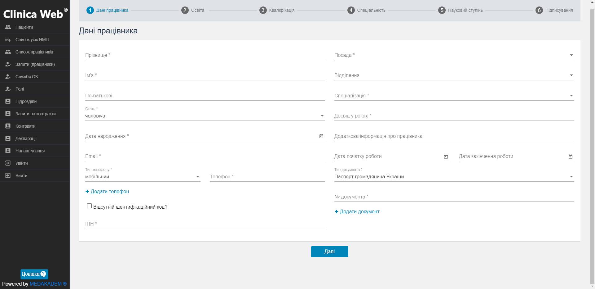
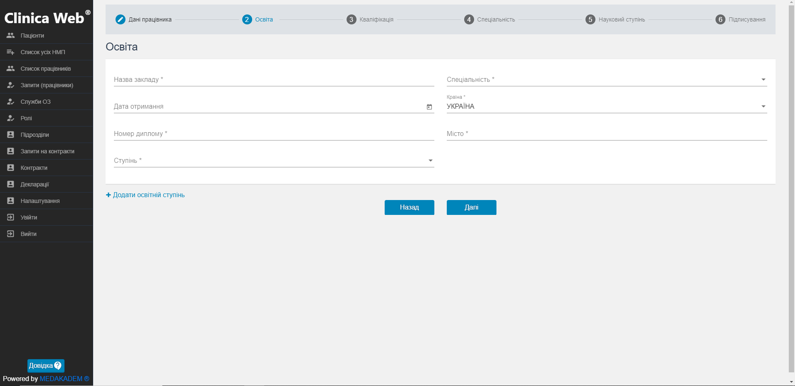
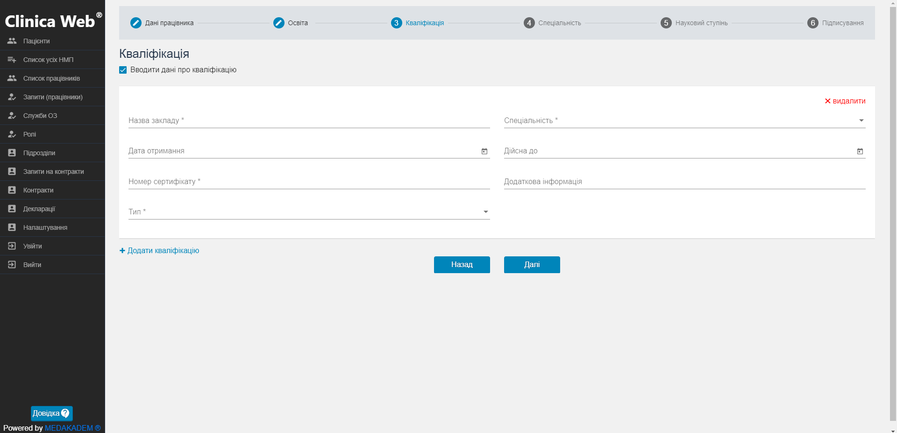
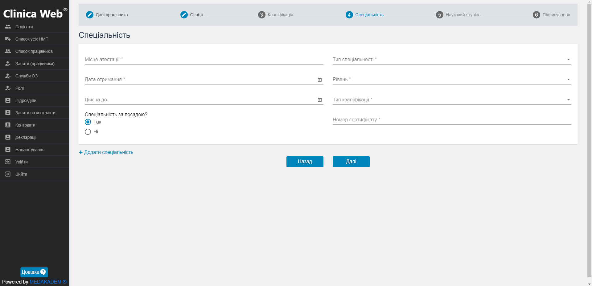
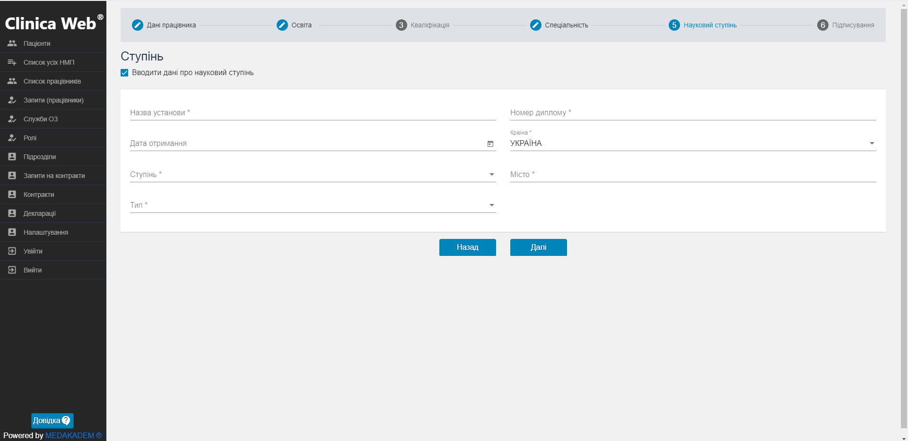

# Інструкція з реєстрації працівника медичної установи

Працівника медичної установи можна зареєструвати в системі eHealth після того, як було зареєстровано медичну установу.    

<b>Важлива інформація!</b>   

Працівник повинен підтвердити свою реєстрацію в системі eHealth, перейшовши за посиланням у листі від системи eHealth, який надійде на вказану під час реєстрації електронну адресу.
  

Необхідні дані для реєстрації в системі EHealth медичної установи:   
<ul><li>прізвище, ім'я, по батькові лікаря, якого необхідно зареєструвати;</li>
<li>дата народження лікаря;</li>
<li>адреса особистої поштової скриньки та номер мобільного телефону лікаря;</li>
<li>ІПН;</li>
<li>дані про освіту, кваліфікацію, науковий ступінь та місце роботи;</li>
<li>дані документа, що посвідчує особу.</li></ul>

   

Виконайте наступні кроки для реєстрації медичної установи в системі EHealth:   
<ol>
<li>
Заповніть необхідні поля з даними про працівника :

- введіть прізвище та ім'я керівника, його стать та дату народження; 
- електронну адресу та номер телефону;
- ідентифікаційний номер за наявності або код паспорта за відсутності;
- оберіть посаду, відділення медичного закладу та спеціалізацію;
- досвід у роках та іншу важливу інформацію про  досвід роботи та освіту;
- дату початку та дату закінчення (останню заповняти не обов'язково) роботи працівника;
- оберіть тип документа, що посвідчує особу, та введіть його номер.
    Обов'язкові для заповнення поля позначені зірочкою - *.   
    Для переходу на наступний крок натисніть кнопку Далі.</li>

<li>Заповніть дані про освіту працівника:

- назву закладу та спеціальніть;
- місце знаходження закладу;
- дата отримання, номер диплому;
- отриманий освітній ступінь.</li>

<li>За потреби уведіть дані про кваліфікацію працівника:

- поставте галочку "Вводити дані про кваліфікацію";
- введіть назву закладу та спеціальніть;
- дату отримання номер та тип сертифікату.</li>

<li>Заповніть дані про спеціальність працівника:

- місце атестації;
- тип спеціальності, рівень;
- тип кваліфікації та номер сертифікату;
- дату отримання документу та дату закінчення його дії;
- відмітьте чи відповідає спеціальніть посаді.</li>

<li>За потреби заповніть дані про наукові ступені працівника:

- поставте галочку "Вводити дані про науковий ступінь";
- введіть назву та місце знаходження установи;
- номер диплому та дату його отримання;
- який науковий ступінь отримано та якого типу.</li>

<li>На вкладці Підписування пройдіть усі кроки:
- клацніть на кнопку Завантажити файл на комп'ютер та виберіть шлях збереження;
- після проходження першого кроку з'явиться кнопка Перейти на сайт для підписання - клацніть на цю кнопку, тоді відкриється сайт онлайн-сервісу створення кваліфікованого електронного підпису на електронні документи;
- оберіть тип носія Файловий носій, кваліфікованого надавача ел. довірчих послуг визначити автоматично, в наступному полі оберіть з комп'ютера файл з ключем та введіть пароль захисту ключа;
- переконайтеся, що у полі Оберіть варіант підпису файлів вибрано "Дані та підпис в одному файлі";
- оберіть файл для підписання, який було завантажено на комп'ютер після виконання першого кроку, та клацніть Підписати;
- у новому вікні клацніть Завантажити;
- поверніться на сторінку підтвердження реєстрації і в третьому кроці завантажте в систему підписаний файл;
- встановіть прапорець біля згоди з обробкою персональних данних та натисніть Відправити.</li>   
</ol>
На поштову скриньку лікаря надійде лист від eHealth для підтвердження реєстрації в системі.   

Щоб завершити реєстрацію лікаря в системі eHealth, лікарю необхідно перейти за посиланням, яке надійшло на вказану під час реєстрації електронну адресу в листі від eHealth, і підтвердити реєстрацію в системі eHealth.

Дані працівника з'являться на вкладці Список працівників.    

>Ви можете перевірити статуси запитів на створення нових працівників в системі натиснувши на пункт меню зліва Запити(працівники).