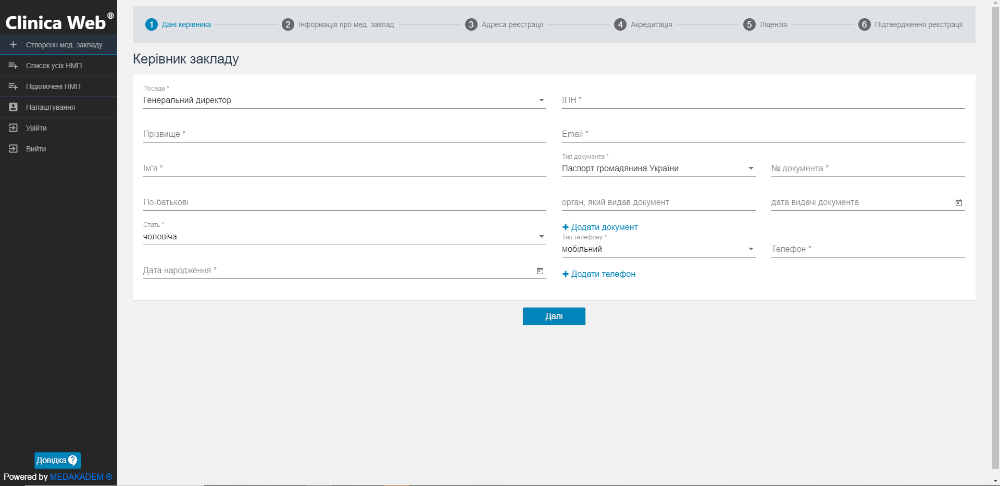
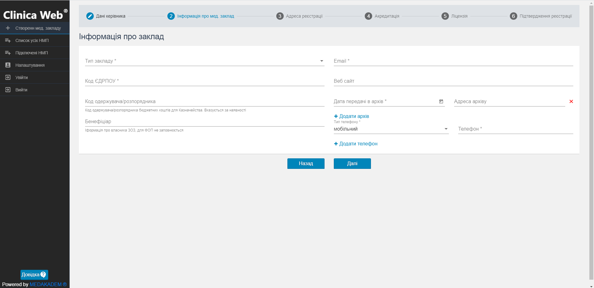
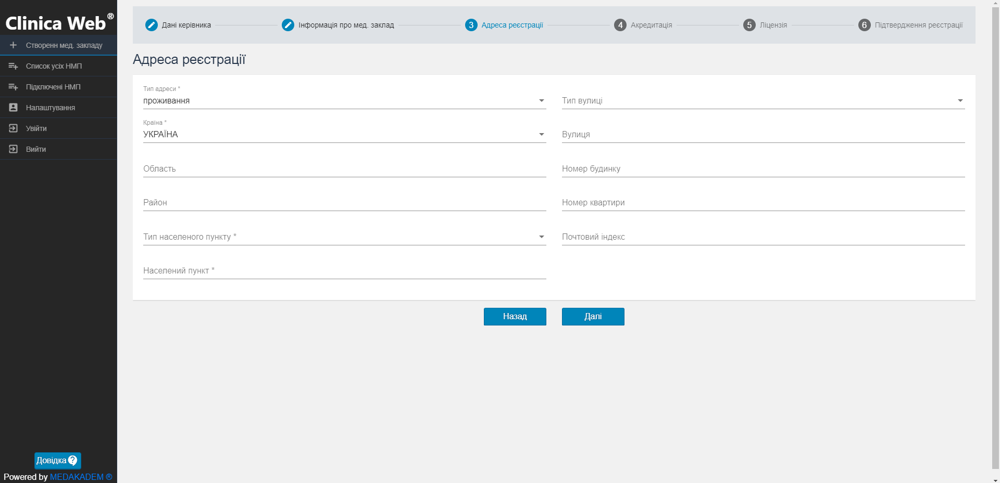
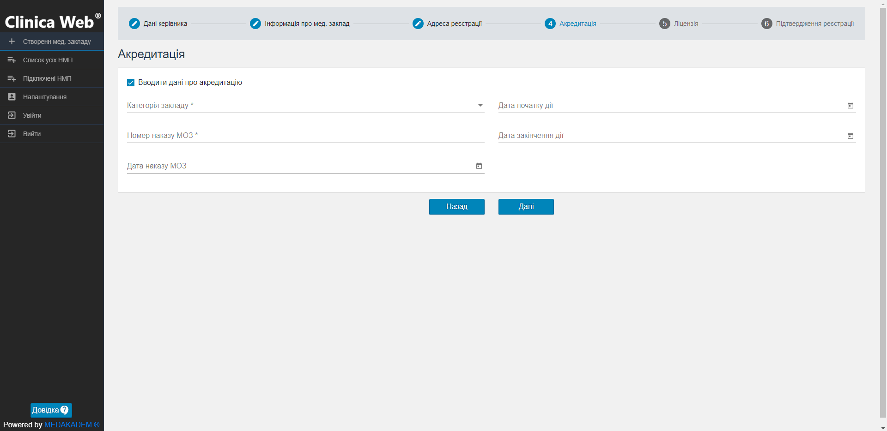
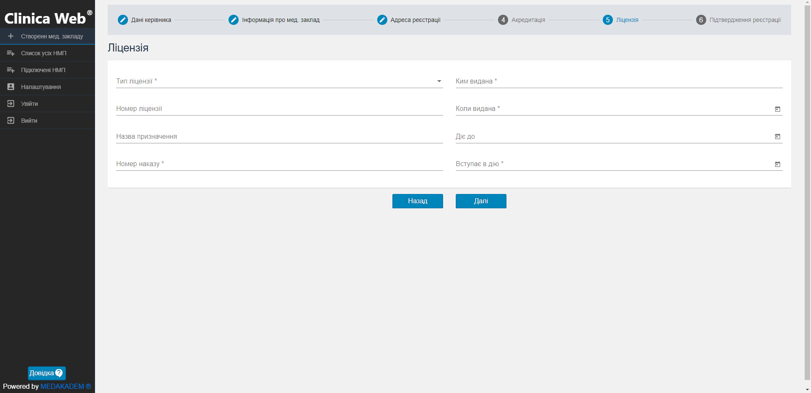
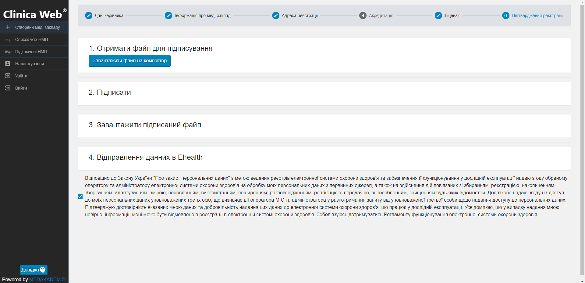

# Інструкція з реєстрації медичної установи

Реєстрацію медичної установи може здійснити представник Медичної інформаційної системи, попередньо зареєстрованої у системі eHealth. Також це може зробити власник або уповноважена особа, клацнувши на головному екрані порталу Medakadem для E-health варіант Створити Заклад Охорони здоров'я.   

<b>Важлива інформація!</b>   

Щоб зареєструвати медичну установу, необхідно попередньо отримати особистий ключ та пароль захисту ключа для накладення електронного цифрового підпису на електронний документ.
   

Необхідні дані для реєстрації в системі EHealth медичної установи:   
<ul><li>дані документа, що засвідчує особу керівника медичної установи;</li>
<li>найменування та адреса реєстрації медичної установи;</li>
<li>код ЄДРПОУ;</li>
<li>дані про акредитацію та ліцензію медичної установи.</li></ul>

    

Виконайте наступні кроки для реєстрації медичної установи в системі EHealth:   

1. Оберіть на головному екрані порталу Medakadem для E-health варіант Створити Заклад Охорони здоров'я.

1. Заповніть необхідні поля з даними про керівника :
- оберіть посаду; 
- введіть прізвище, ім'я та по-батькові керівника, його стать та дату народження; 
- ідентифікаційний номер;
- електронну адресу;
- оберіть тип документа, що посвідчує особу, та введіть його номер;
- також додайте тип та номер телефону керівника.   

Обов'язкові для заповнення поля позначені зірочкою - *.   
Для переходу на наступний крок натисніть кнопку Далі.

2. Заповніть необхідну інформацію про медичний заклад, який реєструється:
- тип закладу;
- код ЄДРПОУ;
- електронну адресу медичного закладу;
- код одержувача/розпорядника бюджетних коштів та бенефіціара за наявності;
- веб-сайт закладу;
- дату передачі документів в архів та адресу архіву;
- телефон мед. закладу.   

Для переходу на наступний крок натисніть кнопку Далі.

3. Введіть дані про адресу реєстрації медичного закладу та клацніть на кнопку Далі.

4. За потреби заповніть інформацію про акредитацію медичного закладу та перейдіть на наступний крок.

5. На вкладці Ліцензія введіть необхідні дані про ліцензію медичної установи, а потім клацніть Далі, щоб перейти на наступну вкладку.

6. На вкладці Підтвердження реєстрації пройдіть усі кроки:
- встановіть прапорець біля згоди з обробкою персональних данних;
- клацніть на кнопку Завантажити файл на комп'ютер та виберіть шлях збереження;
- після проходження першого кроку з'явиться кнопка Перейти на сайт для підписання - клацніть на цю кнопку, тоді відкриється сайт онлайн-сервісу створення кваліфікованого електронного підпису на електронні документи;
- оберіть тип носія Файловий носій, кваліфікованого надавача ел. довірчих послуг визначити автоматично, в наступному полі оберіть з комп'ютера файл з ключем та введіть пароль захисту ключа;
- переконайтеся, що у полі Оберіть варіант підпису файлів вибрано "Дані та підпис в одному файлі";
- оберіть файл для підписання, який було завантажено на комп'ютер після виконання першого кроку, та клацніть Підписати;
- у новому вікні клацніть Завантажити;
- поверніться на сторінку підтвердження реєстрації і в третьому кроці завантажте в систему підписаний файл;
- натисніть Відправити.   

Після успішної реєстрації з'явиться повідомлення про це і на Вашу електронну пошту прийде запрошення до співпраці з eHealth.   
7. Увійдіть до особистої поштової скриньки та перейдіть за посиланням, яке Ви отримали в листі від системи eHealth.   
На сторінці підтвердження реєстрації у першому полі введіть новий пароль, а потім у другому полі введіть пароль повторно, щоб підтвердити.

Біля Даю згоду на обробку моїх персональних даних в системі eHealth установіть прапорець і клацніть Далі.

8. У новому вікні біля Погоджуюсь з Регламентом функціонування системи eHealth установіть прапорець, а потім клацніть Прийняти запрошення.

За умови успішного підтвердження з'явиться повідомлення про прийняте запрошення, а на електронну скриньку надійде лист від eHealth про успішну реєстрацію в системі.

Зареєстрована установа відображається на панелі Підключені НМП.

Ви можете продовжити роботу на сторінці модуля eHealth і зареєструвати відділення установи та <a href="./createEmployee">працівників відділення</a>.
