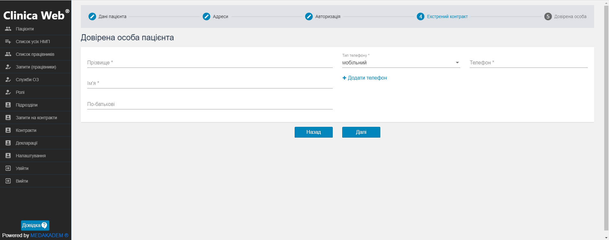

# Робота з деклараціями

<b>Важлива інформація!</b>   

Необхідні дані для подання заявки на створення декларації:   
<ul><li>особисті дані пацієнта;</li>
<li>особисті дані контактної особи пацієнта;</li>
<li>за необхідності, особисті дані довіреної особи пацієнта;</li></ul>

Щоб подати запит на створення декларації:

1. В меню зліва оберіть пункт Декларації.

2. Оберіть працівника. В залежності від обраного працівника буде відображатися список створених декларацій. Також після обрання працівника активується кнопка додання нової декларації.

3. Клацніть на кнопку Додати. Для створення нової декларації виконайте наступні кроки:
    - Введіть дані про пацієнта - його ПІБ, стать, дату народження, місце народження. За потреби введіть електронну адресу та номер мобільного телефону. Зазначте також ідентифікаційний код або код паспорта, документ, що посвідчує особу як громадянина; слово пароль для авторизації пацієнта.
    - Заповніть дані по адресі реєстрації пацієнта.
    - Оберіть бажаний спосіб авторизації - через СМС чи через верифікацію документів. В першому випадку введіть номер телефону пацієнта, натисніть Відправити код підтвердження та уведіть код, який прийшов пацієнту.
    - Введіть дані про довірену особу пацієнта - ПІБ та телефон.
    - Якщо створюється декларація на дитину, на 5му кроці активуйте поле Вводити дані законного працівника та заповніть необхідні поля: ПІБ, стать, дату і місце народження, слово пароль, телефон, дані про документ, що посвідчує довірену особу, а також про документ, що засвідчує довіреність особи.    

Тут Ви можете додати довірену особу.
Щоб зберегти введені дані і створити декларацію, клацніть Підтвердити та створити.

Заявку на створення декларації подано. Декларація відображається на вкладці Запити на декларації.

## Підписати декларацію

1. На вкладці запити на декларації нова декларація відображається зі статусом Нова. Тут Ви можете завантажити необхідні для верифікації документи, якщо при створенні декларації був вибраний відповідний тип авторизації. Також роздрукувати текст декларації, якщо декларація верифікована. 
2. Підтвердіть декларацію.
3. Далі доступні два варіанти - Відхилити декларацію або підписати її.
4. Підписані декларації будуть відображатися на вкладці Декларації. Тут їх можна переглянути детальніше.