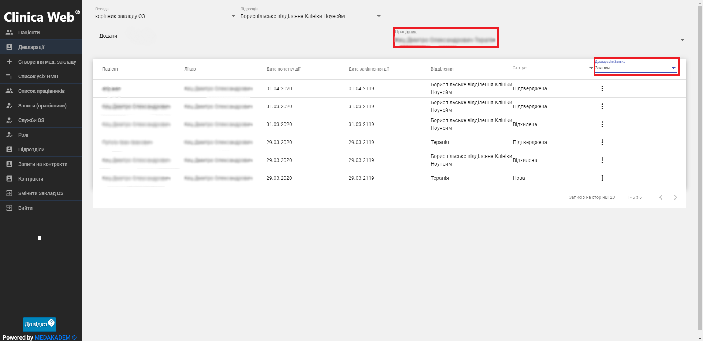

# Робота з деклараціями

<b>Важлива інформація!</b>   

Необхідні дані для подання заявки на створення декларації:   
<ul><li>особисті дані пацієнта;</li>
<li>особисті дані контактної особи пацієнта;</li>
<li>за необхідності, особисті дані довіреної особи пацієнта;</li></ul>

Щоб подати запит на створення декларації:

1. В меню зліва оберіть пункт Декларації.

2. Оберіть працівника. В залежності від обраного працівника буде відображатися список поданих заявок та створених декларацій(вибір в шапці таблиці). 

3. Клацніть на кнопку Додати. Для створення нової декларації виконайте наступні кроки:
    - Введіть дані про пацієнта - його ПІБ, стать, дату народження, місце народження. За потреби введіть електронну адресу та номер мобільного телефону. Зазначте також ідентифікаційний код або код паспорта, документ, що посвідчує особу як громадянина; слово пароль для авторизації пацієнта.
    - Заповніть дані по адресі реєстрації пацієнта.
    - Оберіть бажаний спосіб авторизації - через СМС чи через верифікацію документів. В першому випадку введіть номер телефону пацієнта, натисніть Відправити код підтвердження та уведіть код, який прийшов пацієнту. В другому - після подання декларації необхідно завантажити документи.
    - Введіть дані про довірену особу пацієнта - ПІБ та телефон.
    - Якщо створюється декларація на дитину, на 5му кроці активуйте поле Вводити дані законного працівника та заповніть необхідні поля: ПІБ, стать, дату і місце народження, слово пароль, телефон, дані про документ, що посвідчує довірену особу, а також про документ, що засвідчує довіреність особи. Тут Ви можете додати довірену особу. 
    - Прочитайте пацієнту текст інформаційної згоди та при згоді пацієнта, встановіть прапорець.  

Щоб зберегти введені дані і створити декларацію, клацніть Підтвердити та створити.

Заявку на створення декларації подано. Декларація відображається на вкладці Декларації. Тепер необхідно підтвердити створення декларації.

## Завантажити документи
Якщо під час подання заявки на створення декларації як тип авторизації було вибрано верифікацію документів, то після подання запиту необхідно завантажити відповідні документи.   
Для цього виконайте наступні дії:
1. На вкладці меню Декларації знайдіть потрібну, вона буде відображатись зі статусом Нова. Клацніть на значок "три крапки", щоб відкрити меню дій. Тут виберіть Завантажити документи.
2. Оберіть файли, які містять зображення необхідних документів.

## Підтвердити створення декларації
1. На вкладці Декларації знайдіть потрібну. 
2. Клацніть на значок "три крапки", щоб відкрити меню дій. Тут виберіть Підтведити.

## Підписати декларацію

*Щоб підписати декларацію, необхідно отримати особистий ключ та пароль захисту ключа для накладання електронного цифрового підпису на електронний документ.*    
1. На вкладці Декларації  клацніть на значок "три крапки", щоб відкрити меню дій. Тут виберіть Роздрукувати. Надайте роздруковану заявку пацієнту для підпису.
2. Далі в тому ж меню декларацій оберіть Підписати.
3. На сторінці Підписування декларації виконайте усі кроки. Підписана декларація стає активною і буде відображатись на вкладці Декларації - > при виборі у шапці таблиці декларації зі статусом Активна.