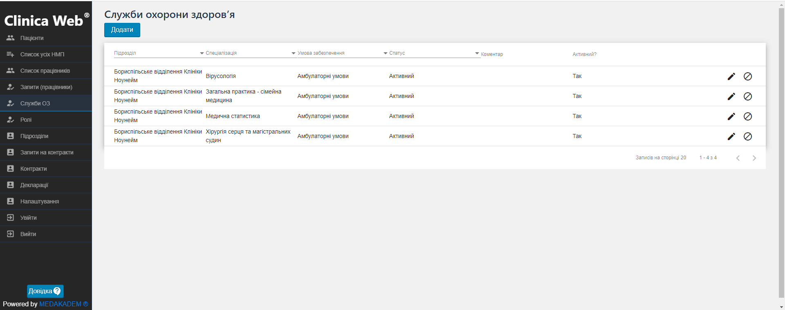
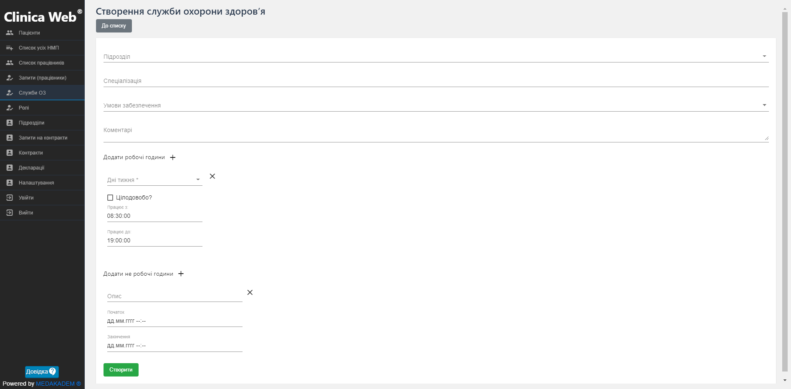
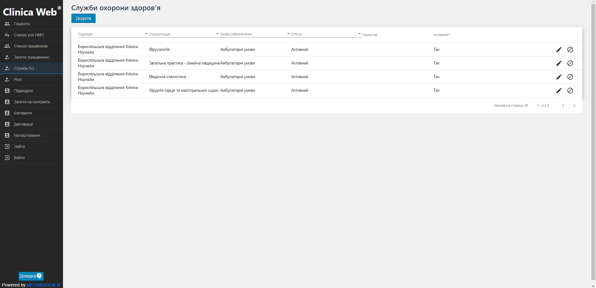
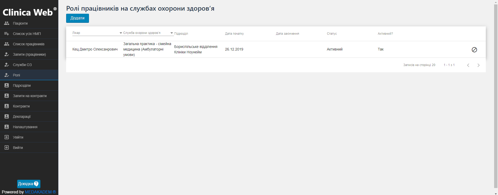

# Служби охорони здоров'я

Щоб створити службу охорони здоров'я, виконайти такі дії:    

1. В меню зліва виберіть пункт Служби ОЗ.

2. Клацніть на кнопку Додати. Оберіть підрозділ, до якого відноситься ця служба ОЗ, її спеціалізацію та умови забезпечення.

3. Налаштуйте графік роботи служби, що створюється.     
Для цього оберіть з випадаючого списку дні, коли служба працює, та робочі години. Також за потреби вкажіть особливі не робочі дні (санітарні дні/свята).

4. Натисніть Створити.

>  Тепер, клацнувши на кнопку До списку, Ви можете повернутися до списку усіх створених Служб охорони здоров'я. Тут Ви можете редагувати або деактивувати створені служби.    

   

## Ролі працівників на службах охорони здоров'я

Щоб назначити працівників на конкретні попередньо створені служби, виконайтте наступні дії:    

1. В меню зліва оберіть пункт Ролі.

2. Клацніть на кнопку додати. Оберіть підрозділ, працівника та службу охорони здоров'я. 

3. Натисніть Створити.

>  За допомогою кнопки До списку, Ви можете повернутися до списку усіх створених ролей працівників. Тут Ви можете деактивувати створені ролі.    

