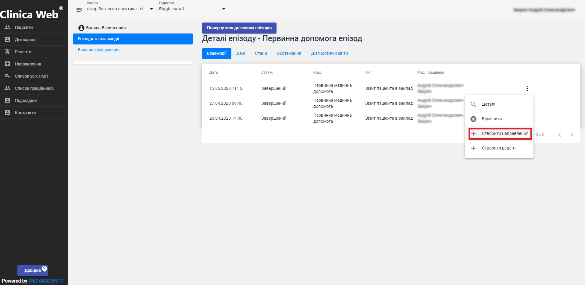
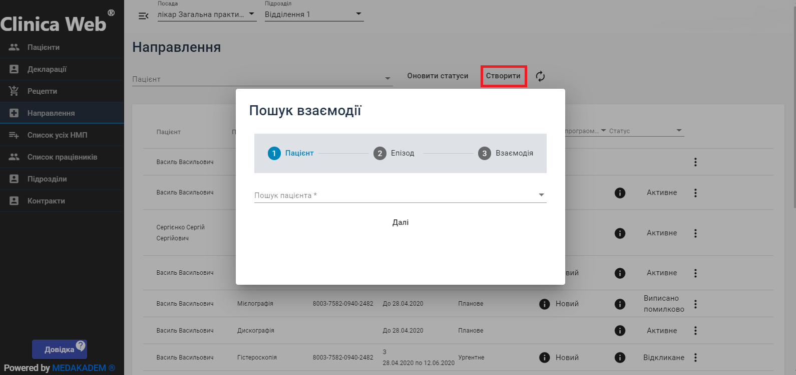

# Робота з медичними записами (епізоди, взаємодії та направлення)

**Епізоди** – це хвороби і стани пацієнта, які складаються із взаємодій (візитів) пацієнта.    
**Взаємодія** - це блок інформації (ПРИЧИНИ ЗВЕРНЕННЯ – ДІАГНОЗИ – ДІЇ), який відноситься до одного епізоду в межах одного епізоду. Один епізод може містити одну або кілька взаємодій.    
**Направлення** - це процес залучення лікуючим лікарем іншого надавача медичної допомоги на підставі оцінки стану здоров’я пацієнта та медичних показань для надання відповідного медичного обслуговування. В електронних медичних записах направленню відповідає електронний документ, який створюється лікарем, який хоче
направити пацієнта в інший ЗОЗ або до іншого лікаря, та є підставою для інших закладів та лікарів надати пацієнту необхідну медичну послугу.   

1. Першим кроком є створення епізоду. Щоб створити епізод по пацієнту:
- Перейдіть з бокового меню на вкладку Пацієнти. Знайдіть в пошуку потрібного пацієнта.
- В останній колонці таблиці пацієнтів натисніть на знак "три крапки", щоб відкрити меню пацієнта. В меню оберіть Картка пацієнта.
- Натисніть Створити новий епізод.
- У вікні створення оберіть тип епізоду, введіть назву та дату початку дії епізоду.
- Після успішного створення в таблиці епізодів з'явиться стрічка з новим епізодом. В меню епізоду (знак "три крапки") можете переглянути деталі епізоду, редагувати назву епізоду, закрити його (якщо хвороба завершилася) або відмінити помилково створений.
2. Далі необхідно наповнити епізод взаємодіями. Щоб створити взаємодію:
- В меню епізоду оберіть Створити взаємодію.
- Оберіть клас і тип взаємодії. Введіть коди взаємодії та причини звернення за класифікацією ICPC2. Уточніть дату проведення взаємодії.
- На вкладці Діагнози заповніть інформацію про діагноз. Спершу створюється основний діагноз, за потреби можна додати ще один нижче (супутній). Оберіть категорію, перетягуючи повзунок на потрібну позицію. Для неосновного діагнозу можливий вибір класифікації по ICD10 .
- Оберіть код діагнозу за класифікацією ICPC2 , вид, клінічний статус та тяжкість діагнозу.
- При потребі додайте доказ - обстеження, на основі якого був виставлений діагноз.
- Є можливість окремо створити стан та обстеження пацієнта.
- Натисніть Зберегти. Щоб зберегти і тим самим створити в системі  eHealth взаємодію, її треба підписати за допомогою електронного цифрового підпису. Слідуйте запропонованим крокам, щоб підписати.
- Після успішного створення взаємодії її можна побачити, якщо відкрити деталі епізоду(з меню епізоду через "три крапки").
3. Тепер можна створити направлення. Зробити це можна двома способами. Перший спосіб:
- В картці пацієнта знайдіть взаємодію, на основі якої необхідно створити направлення, в деталях потрібного епізоду. В меню взаємодії (знак "три крапки") оберіть Створити направлення. 
- Оберіть програму відшкодувань. Пізніше, після заповнення направлення Ви зможете перевірити чи можливе оформлення даного направлення по обраній програмі.
- Оберіть пріоритет та категорію направлення. В залежності від обраної категорії заповніть поля, які активуються. Наприклад, при виборі категорії Госпіталізація активується поле  Спеціальність НМП.
- Налаштуйте дату та час , до якої повинна бути отримана послуга. Натиснувши на дату, яка автоматично згенерувалася, можете змінити її ввівши потрібну або скористатися стрілками зміни та календарем (календар викликається стрілкою вниз). За необхідності Ви можете стерти час або всю дату за допомогою кнопки "хрестик". Також є можливість вибору інтервалу дат - активуйте поле "Період".
- Оберіть послугу, яка повинна бути отримана. Для цього натисніть "Обрати послугу". У вікні вибору з'являться запропоновані послуги. Ви можете скористатися пошуком або обрати з запропонованих. Щоб додати послугу, натисніть "+" біля назви послуги та натисніть Підтвердити.
- За необхідності заповніть інструкції для лікаря та пацієнта.
- В якості причини можна додатково вибрати стан або обстеження пацієнта.
- Далі Ви можете перевірити обрану програму, зберегти направлення без відправки до системи e-Health або створити направлення в системі. Після створення (або збереження) направлення воно з'явиться в таблиці направлень. Щоб створити збережене направлення (тобто відправити його в систему e-Health), клацніть на значок "три крапки" і в меню направлення оберіть редагувати - далі Створити направлення.   
Другий спосіб: 
- Перейдіть з бокового меню на вкладку Направлення. Натисніть Створити.
- Оберіть пацієнта, потрібний епізод та взаємодію. Після вибору з'явиться те ж вікно створення направлення.   

Після створення направлення в меню направлень стануть доступні дії над ним:
1. Видалити - стерти зі списку направлень.
2. Оновити статус - отримати дані про статус (за можливих затримок).
3. Роздрукувати пам'ятку - можливість надрукувати направлення.
4. Картка пацієнта - перехід до карти.
5. Відкликати - за ініціативи користувача (помилка у виписуванні направлення).
6. Відмінити - за непотрібністю пацієнтові.